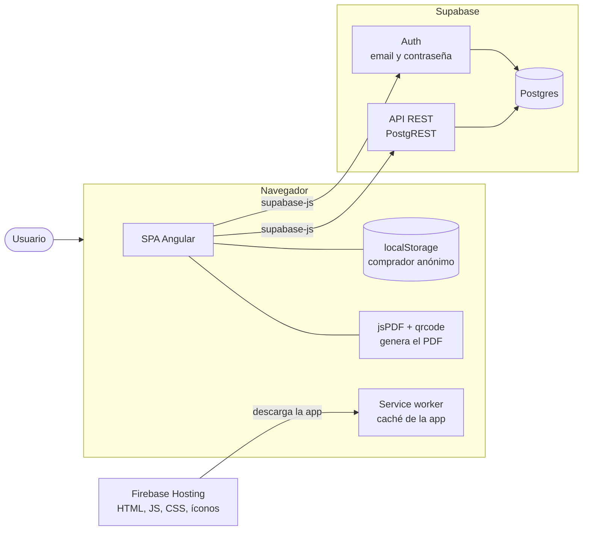
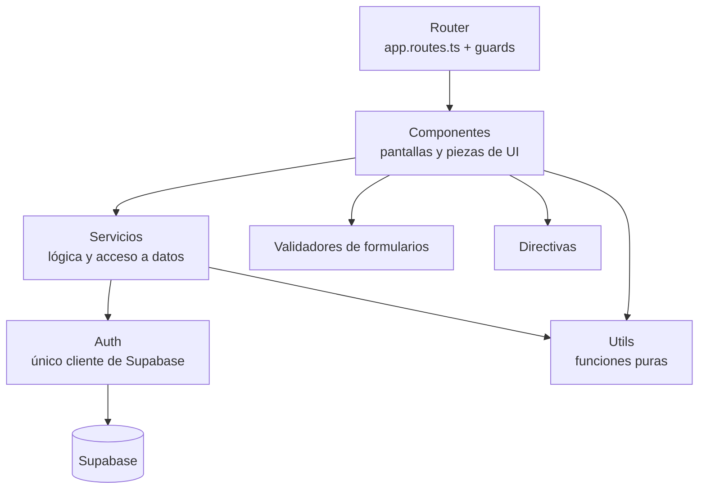
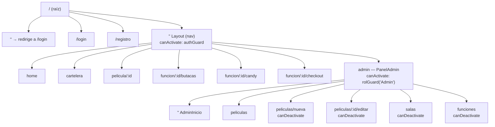
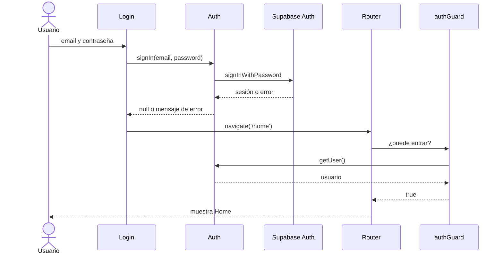
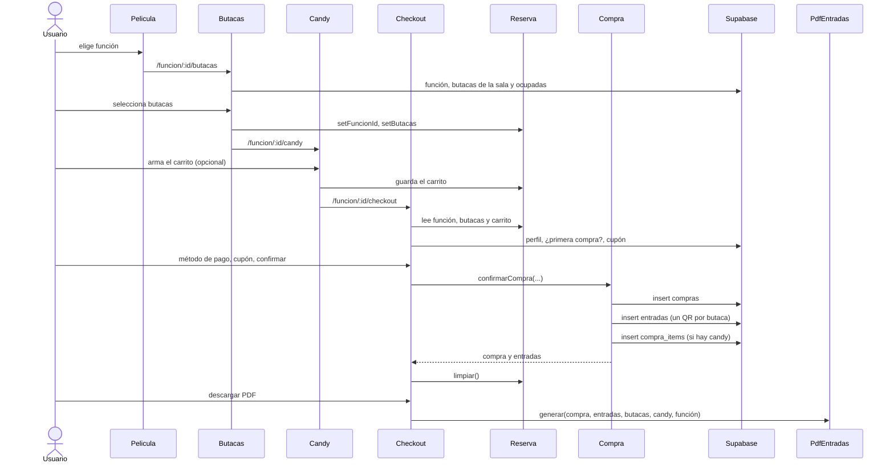
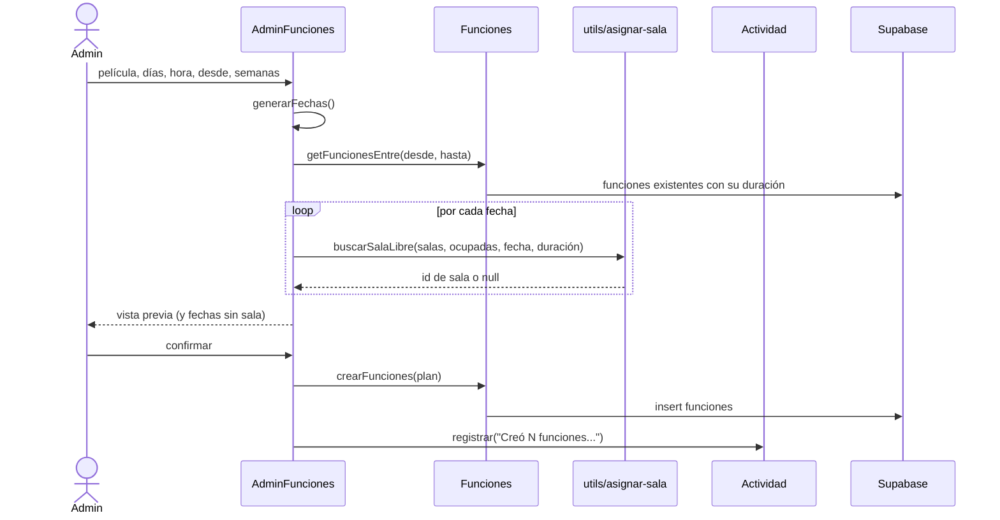
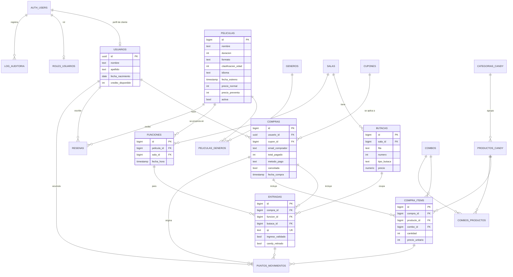
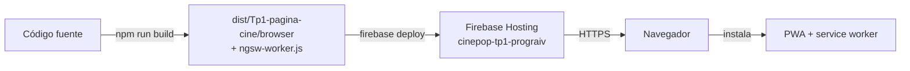

# Cinepop — Documento de arquitectura

Este documento describe **cómo está construido** Cinepop: sus partes, cómo se comunican, cómo se organiza el código, el modelo de datos y cómo se despliega. El **por qué** de cada elección (reglas de negocio y decisiones técnicas) está en el [README](../README.md).

## 1. Visión general

Cinepop es una **SPA (Single Page Application)** hecha en Angular 22. No tiene un backend propio: el navegador habla directamente con **Supabase**, que provee la autenticación y la base de datos Postgres a través de una API REST. Los archivos de la aplicación se sirven desde **Firebase Hosting**, y un **service worker** los guarda en caché para que la app sea instalable como **PWA**.



| Parte | Responsabilidad |
|---|---|
| **SPA Angular** | Toda la interfaz y la lógica de la aplicación: navegación, validaciones, cálculos (totales, descuentos, edad, asignación de salas) y armado de las consultas. |
| **Supabase Auth** | Registro, inicio y cierre de sesión. Guarda la sesión del usuario en el navegador. |
| **Supabase API REST + Postgres** | Persistencia de todos los datos. La app lee y escribe tablas con `supabase-js`. |
| **Firebase Hosting** | Sirve los archivos estáticos del build y redirige cualquier ruta a `index.html`. |
| **Service worker** | Guarda en caché los archivos de la app (solo en producción). |
| **localStorage** | Nombre y email del comprador anónimo. |
| **jsPDF + qrcode** | Generan el PDF de las entradas con su QR, en el navegador. |

## 2. Tecnologías

| Capa | Tecnología |
|---|---|
| Framework | Angular 22, componentes standalone, signals, Reactive Forms, Router con lazy loading |
| Lenguaje | TypeScript |
| Backend como servicio | Supabase (`@supabase/supabase-js`) |
| Documentos | `jspdf`, `qrcode` |
| PWA | `@angular/service-worker`, `manifest.webmanifest` |
| Hosting | Firebase Hosting |

## 3. Arquitectura del frontend

### 3.1 Capas

El código se organiza en capas. Cada una solo usa a las de abajo:



| Capa | Carpeta | Qué contiene |
|---|---|---|
| **Ruteo** | `app.routes.ts`, `guards/` | Qué componente se carga en cada URL y quién puede entrar o salir. |
| **Presentación** | `componentes/` | Las pantallas. Manejan el estado de la vista con signals y llaman a los servicios. No consultan Supabase directamente. |
| **Servicios** | `servicios/` | Singletons (`@Service()`, equivalente a `providedIn: 'root'`). Encapsulan las consultas a Supabase y la lógica compartida. |
| **Acceso a datos** | `servicios/auth.ts` | Crea **una única instancia** del cliente de Supabase; los demás servicios la obtienen con `inject(Auth).client()`. |
| **Utilidades** | `utils/` | Funciones puras sin Angular: asignación de salas, cálculo de edad, formato de fechas. |
| **Validadores** | `validadores/` | Validadores de grupo para Reactive Forms. |
| **Directivas** | `directivas/` | `*appRolAdmin`, directiva estructural que muestra contenido según el rol. |

### 3.2 Estructura de carpetas

```
src/app/
├── app.ts / app.html        componente raíz (solo <router-outlet>)
├── app.config.ts            providers: router y service worker
├── app.routes.ts            definición de rutas
├── componentes/
│   ├── login, registro      pantallas públicas
│   ├── layout, nav          contenedor de las pantallas autenticadas
│   ├── home, cartelera, card-pelicula, pelicula
│   ├── butacas, candy, checkout          flujo de compra
│   └── admin/
│       ├── panel-admin, admin-inicio
│       ├── admin-peliculas, admin-pelicula-form
│       ├── admin-salas
│       └── admin-funciones
├── servicios/               auth, roles, peliculas, funciones, salas, butaca,
│                            resenas, candys, reserva, compra, cupones,
│                            pdf-entradas, actividad
├── guards/                  auth-guard, rol-guard, cambios-sin-guardar-guard
├── validadores/             claves-coinciden, fecha-valida
├── utils/                   asignar-sala, edad, fechas
└── directivas/              rol-admin
```

### 3.3 Servicios y tablas

| Servicio | Responsabilidad | Tablas |
|---|---|---|
| `Auth` | Cliente de Supabase, registro, login, logout, usuario y perfil actual | `usuarios` (+ Supabase Auth) |
| `Roles` | Rol del usuario actual | `roles_usuarios` |
| `Peliculas` | Catálogo, top 3, géneros, ABM y baja lógica | `peliculas`, `peliculas_generos`, `generos`, `resenas`, `funciones` |
| `Funciones` | Funciones de una película, próximas funciones, alta y baja | `funciones` |
| `Salas` | Listado, alta y baja de salas | `salas`, `butacas` |
| `Butaca` | Generar las 518 butacas, butacas de una sala y ocupadas por función | `butacas`, `entradas` |
| `Resenas` | Últimas reseñas | `resenas` |
| `Candys` | Categorías con sus productos | `categorias_candy`, `productos_candy` |
| `Cupones` | Buscar cupones y saber si es la primera compra | `cupones`, `compras` |
| `Compra` | Confirmar la compra | `compras`, `entradas`, `compra_items` |
| `Actividad` | Registrar y leer el log del admin | `log_auditoria` |
| `Reserva` | Estado en memoria de la compra en curso (función, butacas, carrito) | — |
| `PdfEntradas` | Generar el PDF con los QR | — |

### 3.4 Componentes y servicios que usan

| Componente | Servicios |
|---|---|
| `Login`, `Registro` | `Auth` |
| `Nav` | `Auth`, `Reserva` (y `Roles` vía `*appRolAdmin`) |
| `Home` | `Peliculas`, `Resenas` |
| `Cartelera` | `Peliculas` (usa el hijo `CardPelicula`) |
| `Pelicula` | `Peliculas`, `Funciones` |
| `Butacas` | `Butaca`, `Funciones`, `Reserva` |
| `Candy` | `Candys`, `Reserva` |
| `Checkout` | `Reserva`, `Compra`, `Funciones`, `Auth`, `Cupones`, `PdfEntradas` |
| `AdminPeliculas`, `AdminPeliculaForm` | `Peliculas`, `Actividad` |
| `AdminSalas` | `Salas`, `Butaca`, `Actividad` |
| `AdminFunciones` | `Peliculas`, `Salas`, `Funciones`, `Actividad` (y `utils/asignar-sala`) |

## 4. Ruteo y control de acceso



| Guard | Tipo | Dónde | Qué hace |
|---|---|---|---|
| `authGuard` | `CanActivate` | Padre `Layout` | Deja pasar si hay sesión de Supabase o un comprador anónimo en `localStorage`. Si no, navega a `/login`. |
| `rolGuard(rol)` | Función que devuelve un `CanActivate` | `admin` | Consulta el rol en `roles_usuarios`. Si no coincide, devuelve un `UrlTree` a `/home`. |
| `cambiosSinGuardarGuard` | `CanDeactivate` | Formularios del admin | Si el componente informa cambios sin guardar (interfaz `ConCambiosSinGuardar`), pide confirmación antes de salir. |

Todas las rutas usan **lazy loading** (`loadComponent`): el código de cada pantalla se descarga recién al entrar.

**Roles:**

| Rol | Cómo se identifica | Acceso |
|---|---|---|
| Anónimo | Email en `localStorage`, sin sesión | Catálogo y compra |
| Cliente | Sesión de Supabase sin fila en `roles_usuarios` | Catálogo, compra, cupones |
| Admin | Fila en `roles_usuarios` con `rol_usuario = 'Admin'` | Todo, más `/admin` |
| Empleado | Fila con `rol_usuario = 'Empleado'` | Previsto para validar QR (pendiente) |

## 5. Manejo del estado

| Dónde vive | Qué guarda | Duración |
|---|---|---|
| **Signals de cada componente** | Datos de la pantalla (películas, butacas, formularios, mensajes) | Mientras la pantalla está abierta |
| **Servicio `Reserva`** (signals en un singleton) | Función, butacas y carrito de la compra en curso | Hasta confirmar la compra, cerrar sesión o recargar |
| **URL** | Texto de búsqueda de la cartelera (`?buscar=`), ids de película y función | Sobrevive a la recarga y se puede compartir |
| **`localStorage`** | Nombre y email del comprador anónimo | Hasta cerrar sesión |
| **Sesión de Supabase** | Usuario autenticado | Hasta cerrar sesión |
| **Postgres** | Todo lo persistente | Permanente |

## 6. Flujos principales

### 6.1 Ingreso y protección de rutas



El comprador anónimo no pasa por Supabase: `Login` guarda su nombre y email en `localStorage`, y `authGuard` lo deja pasar por eso.

### 6.2 Compra



Controles del checkout antes de confirmar: que la función no haya empezado, la edad mínima de la película (calculada para el registrado, declarada por el anónimo) y la validez del cupón.

### 6.3 Programación de funciones (admin)



Una sala está ocupada desde el inicio de la función hasta el fin de la película **más 30 minutos de limpieza**. Las funciones del mismo lote también se agregan a las ocupadas, para que no se pisen entre sí.

## 7. Modelo de datos



| Grupo | Tablas | Notas |
|---|---|---|
| Usuarios | `usuarios`, `roles_usuarios`, `auth.users` | `usuarios` y `roles_usuarios` usan como clave el `id` de Supabase Auth. |
| Catálogo | `peliculas`, `generos`, `peliculas_generos`, `resenas` | Relación muchos a muchos entre películas y géneros. `activa` implementa la baja lógica. |
| Salas | `salas`, `butacas`, `funciones` | Una función une película, sala y horario. La hora de fin no se guarda: se calcula. |
| Ventas | `compras`, `entradas`, `compra_items`, `cupones` | Una compra tiene una entrada por butaca y un ítem por producto o combo. El precio del candy se congela en `precio_unitario`. |
| Candy | `categorias_candy`, `productos_candy`, `combos`, `combos_productos` | Los combos están modelados pero todavía no se usan. |
| Fidelización | `puntos_movimientos` | Saldo = suma de movimientos. Pendiente de implementar. |
| Auditoría | `log_auditoria` | Texto libre por evento, con usuario y email. |

Restricciones relevantes en la base: `CHECK` sobre los valores permitidos (`formato`, `idioma`, `clasificacion_edad`, `tipo_butaca`, `metodo_pago`, `tipo_cupon`, `rol_usuario`, `calificacion`) y `UNIQUE` en `entradas.qr`, `salas.nombre`, `generos.nombre` y `cupones.codigo_cupon`.

## 8. Seguridad

- **Autenticación:** Supabase Auth con email y contraseña. La sesión la maneja `supabase-js` en el navegador.
- **Autorización en la app:** `authGuard` y `rolGuard` deciden qué rutas se pueden abrir; `*appRolAdmin` oculta elementos de la interfaz.
- **Autorización en la base:** **pendiente.** RLS no está activado, así que hoy el control es solo del lado del cliente. La clave del repositorio es la *publishable key*, pensada para el navegador; la protección real depende de configurar políticas RLS por tabla.

## 9. Despliegue



- `npm run build` genera el build de producción. Con la configuración de producción se activa el **service worker** (`ngsw-config.json`): los archivos de la app se descargan de antemano (`prefetch`) y las imágenes y fuentes a medida que se usan (`lazy`).
- `firebase deploy` publica la carpeta del build. `firebase.json` redirige **todas las rutas a `index.html`**, necesario para que el router de Angular resuelva una URL interna al recargar.
- Firebase sirve por **HTTPS**, requisito para registrar el service worker e instalar la PWA.
- Supabase es un servicio administrado: no se despliega con la app. Su URL y la clave pública están en `src/environments/environments.ts`.

## 10. Limitaciones y evolución

Las limitaciones actuales y la lista de funcionalidades pendientes están en el [README](../README.md#limitaciones-conocidas). Las de mayor impacto en la arquitectura son:

- **Sin RLS:** la seguridad de los datos depende de configurar políticas en Supabase.
- **Compra no atómica:** son tres inserciones desde el cliente. Para que sea todo o nada, habría que moverla a una función de la base (RPC).
- **Sin restricción única en `entradas (funcion_id, butaca_id)`** ni sincronización en tiempo real: dos compras simultáneas podrían tomar la misma butaca.
- **Estado de la compra en memoria:** se pierde al recargar la página.
