# Cinepop: documento de arquitectura

Este documento describe **cómo está construido** Cinepop: sus partes, cómo se comunican, cómo se organiza el código, el modelo de datos y cómo se despliega. El **por qué** de cada elección (reglas de negocio y decisiones técnicas) está en [DECISIONES.md](DECISIONES.md).

## 1. Visión general

Cinepop es una **SPA (Single Page Application)** hecha en Angular 22. No tiene un backend propio: el navegador habla directamente con **Supabase**, que provee:
- La autenticación.
- La base de datos Postgres, a través de una API REST.
- Los mensajes en tiempo real (**Realtime**).

Los archivos de la aplicación se sirven desde **Firebase Hosting**, y un **service worker** los guarda en caché para que la app sea instalable como **PWA**.

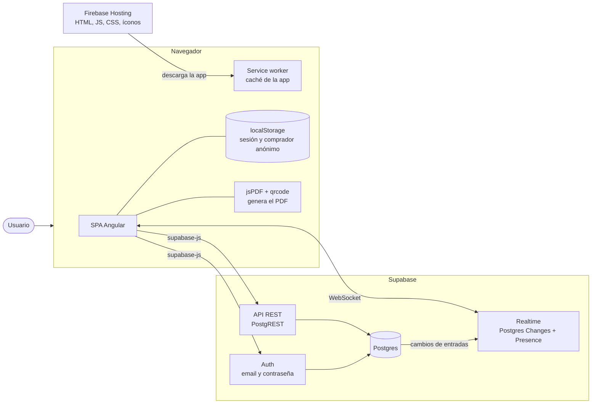

| Parte | Responsabilidad |
|---|---|
| **SPA Angular** | Toda la interfaz y la lógica de la aplicación: navegación, validaciones, cálculos (totales, descuentos, crédito, puntos, edad, asignación de salas) y armado de las consultas. |
| **Supabase Auth** | Registro, inicio y cierre de sesión de clientes, admin y empleados. |
| **Supabase API REST + Postgres** | Persistencia de todos los datos. La app lee y escribe tablas con `supabase-js`. |
| **Supabase Realtime** | Avisa en vivo los cambios de `entradas` (butacas compradas) y comparte entre pantallas las butacas que cada uno está eligiendo (Presence). |
| **Firebase Hosting** | Sirve los archivos estáticos del build y redirige cualquier ruta a `index.html`. |
| **Service worker** | Guarda en caché los archivos de la app (solo en producción). |
| **localStorage** | Sesión de Supabase y nombre y email del comprador anónimo. |
| **jsPDF + qrcode** | Generan el PDF de las entradas con su QR, en el navegador. |

## 2. Tecnologías

| Capa | Tecnología |
|---|---|
| Framework | Angular 22, componentes standalone, signals, Reactive Forms, Router con lazy loading |
| Lenguaje | TypeScript |
| Backend como servicio | Supabase (`@supabase/supabase-js`): Auth, Postgres, Realtime |
| Documentos | `jspdf`, `qrcode` |
| PWA | `@angular/service-worker`, `manifest.webmanifest` |
| Hosting | Firebase Hosting |

## 3. Arquitectura del frontend

### 3.1 Capas

El código se organiza en capas. Cada una solo usa a las de abajo:

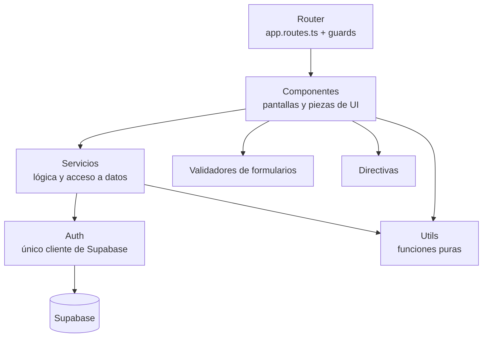

| Capa | Carpeta | Qué contiene |
|---|---|---|
| **Ruteo** | `app.routes.ts`, `guards/` | Qué componente se carga en cada URL y quién puede entrar o salir. |
| **Presentación** | `componentes/` | Las pantallas. Manejan el estado de la vista con signals y llaman a los servicios. No consultan Supabase directamente. |
| **Servicios** | `servicios/` | Singletons (`@Service()`, equivalente a `providedIn: 'root'`). Encapsulan las consultas a Supabase, los canales de Realtime y la lógica compartida. |
| **Acceso a datos** | `servicios/auth.ts` | Crea **una única instancia** del cliente de Supabase; los demás servicios la obtienen con `inject(Auth).client()`. La única excepción es `Empleados`, que crea un cliente aparte sin sesión solo para el alta. |
| **Utilidades** | `utils/` | Funciones puras sin Angular: asignación de salas, cálculo de edad, formato de fechas. |
| **Validadores** | `validadores/` | Validadores de grupo para Reactive Forms. |
| **Directivas** | `directivas/` | `*appRolAdmin`, directiva estructural que muestra contenido según el rol. |

### 3.2 Estructura de carpetas

```
src/app/
├── app.ts / app.html        componente raíz (solo <router-outlet>)
├── app.config.ts            providers: router, service worker y locale es-AR
├── app.routes.ts            definición de rutas (con comodín **)
├── componentes/
│   ├── login, registro                       pantallas públicas
│   ├── layout, nav                           contenedor de las pantallas autenticadas
│   ├── home, cartelera, card-pelicula, pelicula
│   ├── butacas, candy, checkout              flujo de compra
│   ├── mi-cuenta                             crédito, puntos, Mis películas, Mis compras
│   ├── validar-qr                            pantalla del empleado
│   └── admin/
│       ├── panel-admin, admin-inicio
│       ├── admin-peliculas, admin-pelicula-form
│       ├── admin-salas, admin-funciones
│       ├── admin-candy, admin-producto-form, admin-combo-form
│       ├── admin-cupones, admin-recompensas  (hijo de cupones)
│       ├── admin-reportes, admin-actividad
│       └── admin-empleados
├── servicios/               auth, roles, peliculas, funciones, salas, butaca,
│                            butacas-en-vivo, resenas, candys, reserva, compra,
│                            cupones, puntos, validacion, empleados, reportes,
│                            pdf-entradas, actividad
├── guards/                  auth-guard, rol-guard, cambios-sin-guardar-guard
├── validadores/             claves-coinciden, fecha-valida
├── utils/                   asignar-sala, edad, fechas
└── directivas/              rol-admin
```

### 3.3 Servicios y tablas

| Servicio | Responsabilidad | Tablas |
|---|---|---|
| `Auth` | Cliente de Supabase, registro, login, logout, usuario y perfil actual | `usuarios` (+ Supabase Auth) |
| `Roles` | Rol del usuario actual | `roles_usuarios` |
| `Peliculas` | Cartelera (ya estrenadas), Próximamente, top 3, géneros, ABM y baja lógica | `peliculas`, `peliculas_generos`, `generos`, `resenas`, `funciones` |
| `Funciones` | Funciones de una película, próximas funciones, alta y baja | `funciones` |
| `Salas` | Listado, alta y baja de salas | `salas`, `butacas` |
| `Butaca` | Generar las 518 butacas, butacas de una sala, ocupadas por función y canal de Realtime (Postgres Changes) | `butacas`, `entradas` |
| `ButacasEnVivo` | Canal de Realtime Presence por función: publica las butacas elegidas y expone las que eligen otros | — (Realtime) |
| `Resenas` | Últimas reseñas, reseñas de un usuario, ¿ya reseñó?, ¿vio la película?, crear reseña | `resenas`, `entradas`, `compras`, `funciones` |
| `Candys` | Categorías, productos y combos (ABM y activos) | `categorias_candy`, `productos_candy`, `combos`, `combos_productos` |
| `Cupones` | Buscar cupones, primera compra y ABM | `cupones`, `compras` |
| `Compra` | Confirmar (con código, crédito, canjes y puntos), deshacer, Mis compras y cancelar | `compras`, `entradas`, `compra_items`, `usuarios`, `puntos_movimientos` |
| `Puntos` | Saldo, movimientos, revertir una compra y ABM de recompensas | `puntos_movimientos`, `recompensas` |
| `Validacion` | Buscar una compra por código, validar el ingreso y entregar el candy | `compras`, `entradas`, `compra_items` |
| `Empleados` | Listar, dar de alta (con un segundo cliente sin sesión) y dar de baja | `roles_usuarios` (+ Supabase Auth) |
| `Reportes` | Compras no canceladas de un período, con sus entradas y su candy | `compras`, `entradas`, `compra_items` |
| `Actividad` | Registrar y leer el log de auditoría | `log_auditoria` |
| `Reserva` | Estado en memoria de la compra en curso (función, butacas, carrito, combo) | — |
| `PdfEntradas` | Generar el PDF con el QR de la compra | — |

### 3.4 Componentes y servicios que usan

| Componente | Servicios |
|---|---|
| `Login`, `Registro` | `Auth` |
| `Nav` | `Auth`, `Reserva` (y `Roles` vía `*appRolAdmin`) |
| `Home` | `Peliculas`, `Resenas`, `Candys`, `Reserva` |
| `Cartelera` | `Peliculas` (usa el hijo `CardPelicula`) |
| `Pelicula` | `Peliculas`, `Funciones`, `Auth`, `Resenas` |
| `Butacas` | `Butaca`, `ButacasEnVivo`, `Funciones`, `Reserva` |
| `Candy` | `Candys`, `Reserva` |
| `Checkout` | `Reserva`, `Compra`, `Funciones`, `Auth`, `Cupones`, `Puntos`, `PdfEntradas` |
| `MiCuenta` | `Auth`, `Compra`, `Puntos`, `Resenas` |
| `ValidarQr` | `Validacion`, `Actividad` |
| `AdminPeliculas`, `AdminPeliculaForm` | `Peliculas`, `Actividad` |
| `AdminSalas` | `Salas`, `Butaca`, `Actividad` |
| `AdminFunciones` | `Peliculas`, `Salas`, `Funciones`, `Actividad` (y `utils/asignar-sala`) |
| `AdminCandy`, `AdminProductoForm`, `AdminComboForm` | `Candys`, `Actividad` |
| `AdminCupones` | `Cupones`, `Actividad` (usa el hijo `AdminRecompensas`) |
| `AdminRecompensas` | `Puntos`, `Candys`, `Actividad` |
| `AdminReportes` | `Reportes` |
| `AdminActividad` | `Actividad` |
| `AdminEmpleados` | `Empleados`, `Actividad` |

## 4. Ruteo y control de acceso

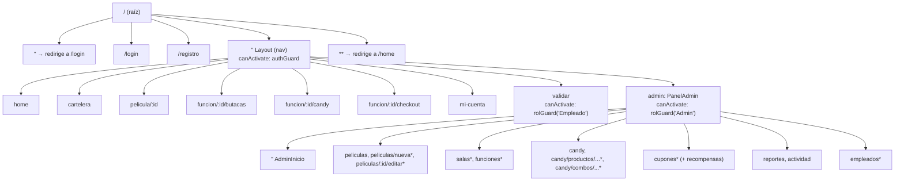

Las rutas marcadas con `*` tienen `canDeactivate: [cambiosSinGuardarGuard]`.

| Guard | Tipo | Dónde | Qué hace |
|---|---|---|---|
| `authGuard` | `CanActivate` | Padre `Layout` | Deja pasar si hay sesión de Supabase o un comprador anónimo en `localStorage`. Si no, navega a `/login`. |
| `rolGuard(rol)` | Función que devuelve un `CanActivate` | `admin` y `validar` | Consulta el rol en `roles_usuarios`. Si no coincide, devuelve un `UrlTree` a `/home`. |
| `cambiosSinGuardarGuard` | `CanDeactivate` | Formularios del admin | Si el componente informa cambios sin guardar (interfaz `ConCambiosSinGuardar`), pide confirmación antes de salir. |

Todas las rutas usan **lazy loading** (`loadComponent`): el código de cada pantalla se descarga recién al entrar.

**Roles:**

| Rol | Cómo se identifica | Acceso |
|---|---|---|
| Anónimo | Email en `localStorage`, sin sesión | Catálogo y compra (sin cupones de cliente, puntos, crédito ni reseñas) |
| Cliente | Sesión de Supabase con fila en `usuarios` | Catálogo, compra, cupones, puntos, crédito, reseñas y **Mi cuenta** |
| Empleado | Fila en `roles_usuarios` con `rol_usuario = 'Empleado'` | **Validar QR** |
| Admin | Fila en `roles_usuarios` con `rol_usuario = 'Admin'` | Todo, más `/admin` |

## 5. Manejo del estado

| Dónde vive | Qué guarda | Duración |
|---|---|---|
| **Signals de cada componente** | Datos de la pantalla (películas, butacas, formularios, mensajes) | Mientras la pantalla está abierta |
| **Servicio `Reserva`** (signals en un singleton) | Función, butacas, carrito y combo de la compra en curso | Hasta confirmar la compra, cerrar sesión o recargar |
| **Servicio `ButacasEnVivo`** | Canal de Presence de la función y las butacas que eligen otros | Mientras se navega dentro de `/funcion/...` |
| **Canal de Realtime (Presence)** | Las butacas que cada pantalla tiene marcadas | Mientras la pestaña está conectada al canal |
| **URL** | Texto de búsqueda de la cartelera (`?buscar=`), ids de película y función | Sobrevive a la recarga y se puede compartir |
| **`localStorage`** | Sesión de Supabase y nombre y email del comprador anónimo | Hasta cerrar sesión |
| **Postgres** | Todo lo persistente (incluido el crédito y los puntos) | Permanente |

## 6. Flujos principales

### 6.1 Ingreso y protección de rutas

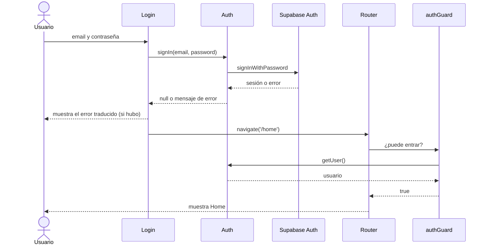

El comprador anónimo no pasa por Supabase: `Login` guarda su nombre y email en `localStorage`, y `authGuard` lo deja pasar por eso.

### 6.2 Butacas en tiempo real

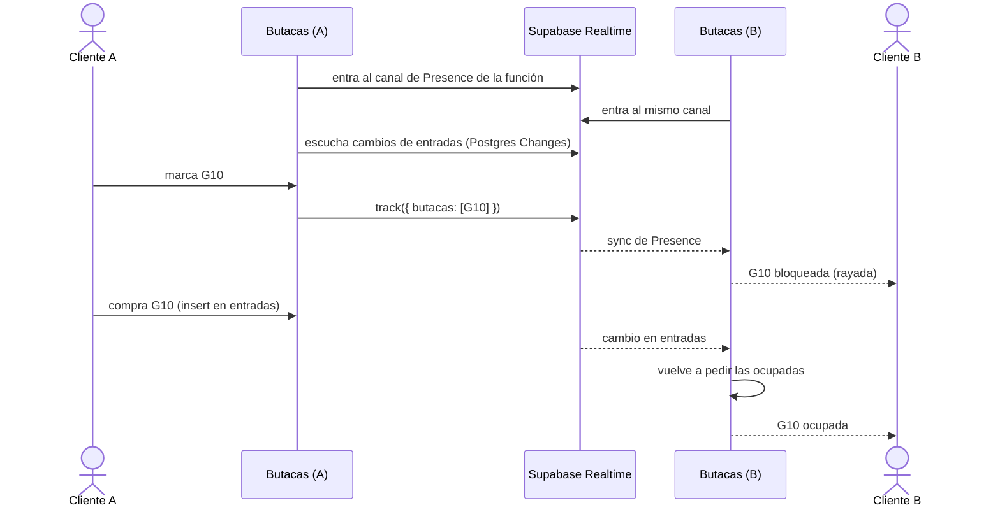

Si A cierra la pestaña o sale del flujo de compra, Realtime lo saca del canal y la butaca vuelve a estar libre para B. El índice único de `entradas` es la última barrera si dos personas confirman la misma butaca a la vez.

### 6.3 Compra

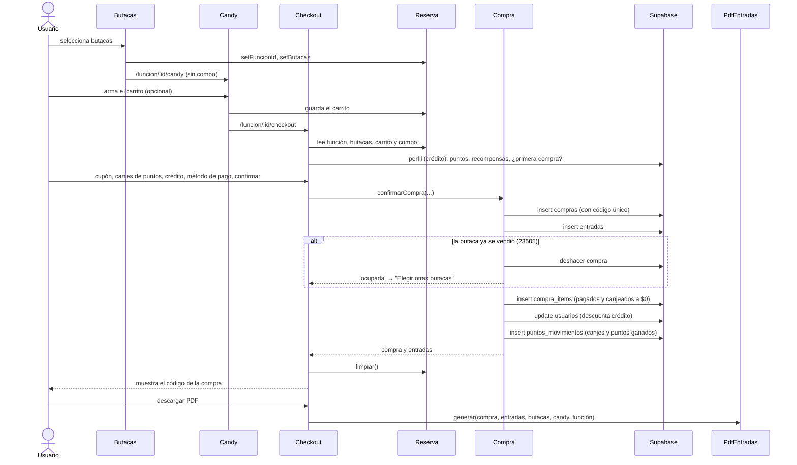

Controles del checkout antes de confirmar:
- Que la función no haya empezado.
- La edad mínima de la película: calculada para el registrado, declarada por el anónimo.
- La validez del cupón.
- Que no se canjeen más puntos de los que hay.

Con combo, `Butacas` va directo al checkout y exige elegir exactamente las entradas del combo.

### 6.4 Cancelación

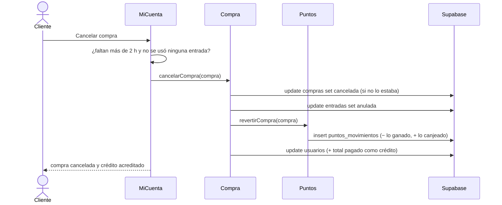

Al anularse las entradas, Realtime avisa a las pantallas de butacas abiertas y esas butacas se liberan.

### 6.5 Validación del QR (empleado)

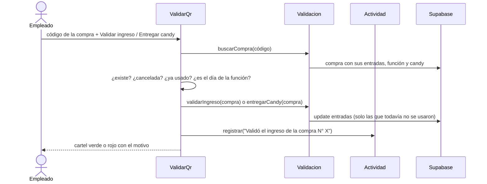

### 6.6 Programación de funciones (admin)

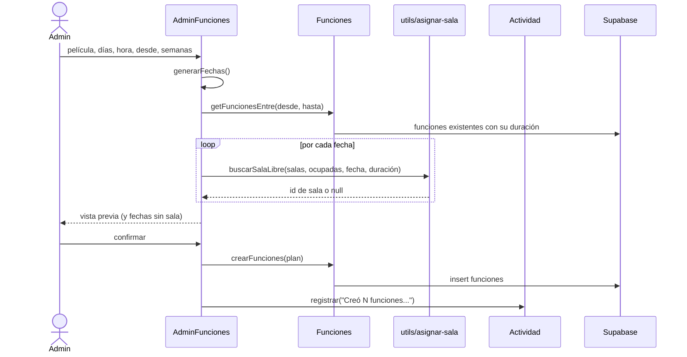

Una sala está ocupada desde el inicio de la función hasta el fin de la película **más 30 minutos de limpieza**. Las funciones del mismo lote también se agregan a las ocupadas, para que no se pisen entre sí.

## 7. Modelo de datos

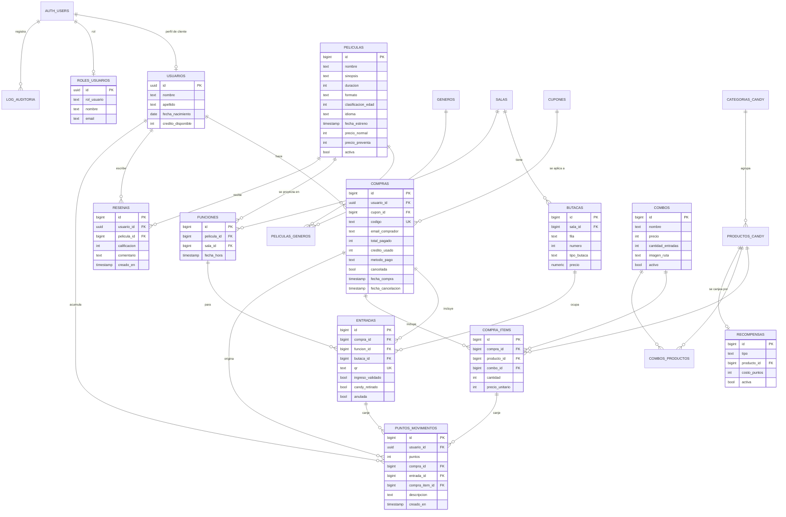

| Grupo | Tablas | Notas |
|---|---|---|
| Usuarios | `usuarios`, `roles_usuarios`, `auth.users` | `usuarios` y `roles_usuarios` usan como clave el `id` de Supabase Auth. `usuarios.credito_disponible` guarda el crédito por cancelaciones. |
| Catálogo | `peliculas`, `generos`, `peliculas_generos`, `resenas` | Relación muchos a muchos entre películas y géneros. `activa` implementa la baja lógica y `fecha_estreno` separa la cartelera de Próximamente. |
| Salas | `salas`, `butacas`, `funciones` | Una función une película, sala y horario. La hora de fin no se guarda: se calcula. |
| Ventas | `compras`, `entradas`, `compra_items`, `cupones` | Una compra tiene un código único (el del QR), una entrada por butaca y un ítem por producto o combo. Al cancelar, la compra queda `cancelada` y sus entradas `anuladas`. |
| Candy | `categorias_candy`, `productos_candy`, `combos`, `combos_productos` | Un combo tiene precio fijo, cantidad de entradas y productos. |
| Fidelización | `puntos_movimientos`, `recompensas` | Saldo = suma de movimientos. Cada canje se vincula a su entrada o ítem. `recompensas` guarda el costo en puntos de la entrada gratis y de cada producto. |
| Auditoría | `log_auditoria` | Texto libre por evento, con usuario, email y fecha. Incluye las validaciones de QR. |

Restricciones relevantes en la base:
- **`CHECK`** sobre los valores permitidos:
  - `formato`, `idioma`, `clasificacion_edad`, `tipo_butaca`, `calificacion`, `rol_usuario`.
  - `metodo_pago`: Tarjeta, Efectivo, Crédito, Tarjeta + Crédito, Efectivo + Crédito y Puntos.
  - `recompensas.tipo`.
  - Que `tipo_cupon` no esté vacío.
  - Que un ítem sea producto o combo, nunca los dos.
  - Que los puntos de un movimiento no sean 0.
- **`UNIQUE`:**
  - `compras.codigo`, `entradas.qr` y `resenas (usuario_id, pelicula_id)`.
  - `salas.nombre`, `generos.nombre`, `cupones.codigo_cupon`, `productos_candy.nombre`, `combos.nombre` y `categorias_candy.nombre`.
  - `butacas (sala_id, fila, numero)` y una recompensa por tipo y producto.
- **Índice único parcial** `entradas (funcion_id, butaca_id) WHERE NOT anulada`: una butaca no se puede vender dos veces para la misma función, pero sí volver a venderse si la compra anterior se canceló.

## 8. Seguridad

- **Autenticación:** Supabase Auth con email y contraseña. La sesión la maneja `supabase-js` en el navegador. El alta de empleados usa un cliente aparte sin sesión, para no pisar la del admin.
- **Autorización en la app:**
  - `authGuard` y `rolGuard('Admin')` / `rolGuard('Empleado')` deciden qué rutas se pueden abrir.
  - `*appRolAdmin` oculta elementos de la interfaz.
- **Autorización en la base:** **parcial.**
  - Solo `entradas` tiene RLS, con policies abiertas para `anon` y `authenticated`, necesarias para Realtime.
  - El resto de las tablas no tiene RLS, así que el control es del lado del cliente.
  - La clave del repositorio es la *publishable key*, pensada para el navegador; la protección real depende de configurar políticas RLS por tabla y por rol.
- **Realtime:** los canales son públicos (sin `private: true`), y el proyecto tiene activado *Allow public access*.

## 9. Despliegue

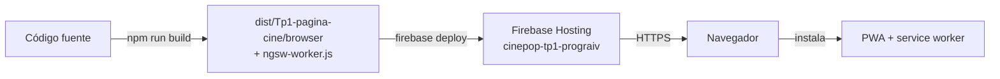

- `npm run build` genera el build de producción. Con la configuración de producción se activa el **service worker** (`ngsw-config.json`): los archivos de la app se descargan de antemano (`prefetch`) y las imágenes y fuentes a medida que se usan (`lazy`).
- `firebase deploy` publica la carpeta del build. `firebase.json` redirige **todas las rutas a `index.html`**, necesario para que el router de Angular resuelva una URL interna al recargar.
- Firebase sirve por **HTTPS**, requisito para registrar el service worker e instalar la PWA.
- Supabase es un servicio administrado: no se despliega con la app. Su URL y la clave pública están en `src/environments/environments.ts`. Los cambios de la base (columnas, índices, policies y la publicación de Realtime) se aplican desde el SQL Editor de Supabase.

## 10. Limitaciones y evolución

El detalle está en [DECISIONES.md](DECISIONES.md#limitaciones-conocidas). Las de mayor impacto en la arquitectura son:

- **RLS parcial:** la seguridad de los datos depende de configurar políticas en el resto de las tablas.
- **Compra y cancelación no transaccionales:** son varias operaciones desde el cliente, con una compensación (`deshacerCompra`) si algo falla. Para que sean todo o nada habría que moverlas a funciones de la base (RPC).
- **Crédito con lectura y escritura desde el cliente:** dos operaciones simultáneas de la misma cuenta podrían pisarse. Una RPC con `credito_disponible = credito_disponible + monto` lo resolvería.
- **Controles de hora en el navegador:** dependen del reloj de quien usa la app.
- **Estado de la compra en memoria:** se pierde al recargar la página.
- **Precio de la entrada:** todavía sale de la butaca y no de la película (preventa pendiente).
